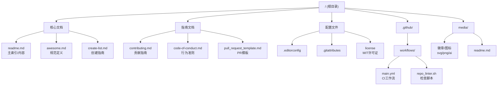
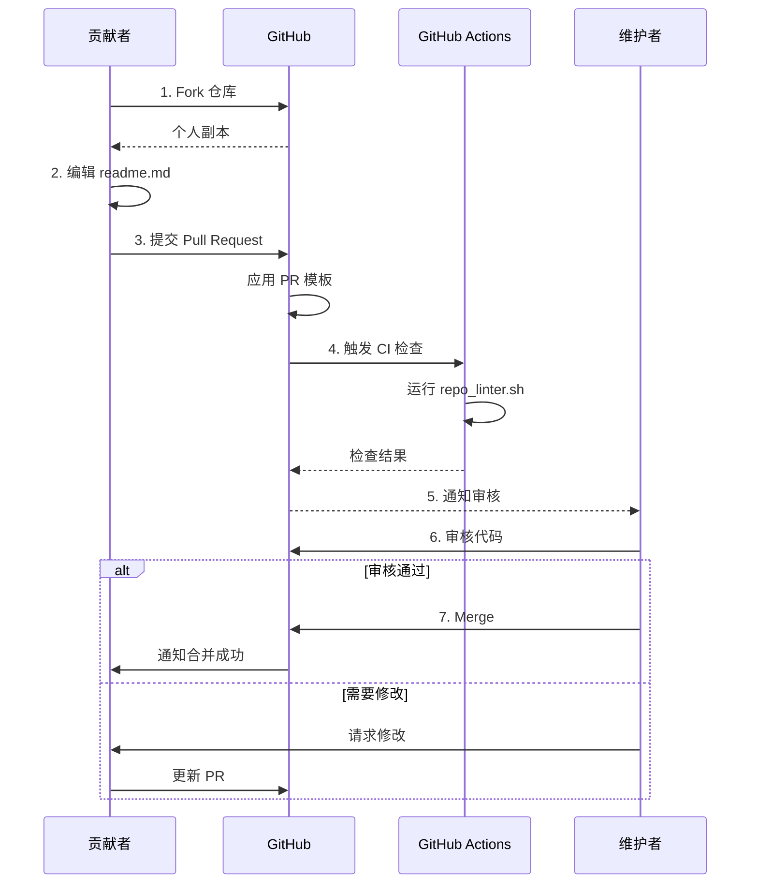
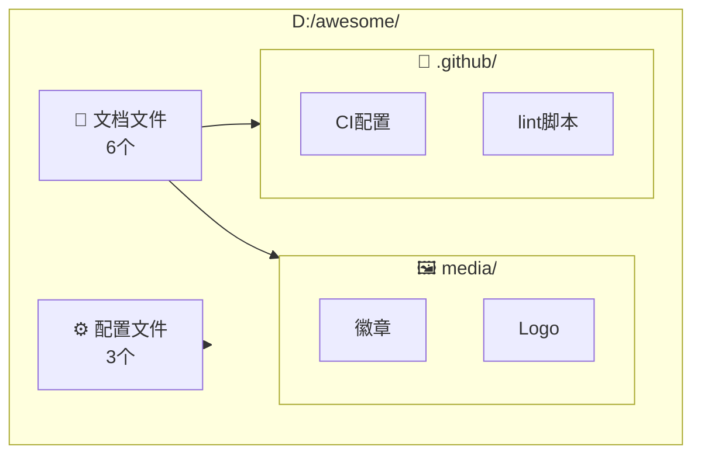
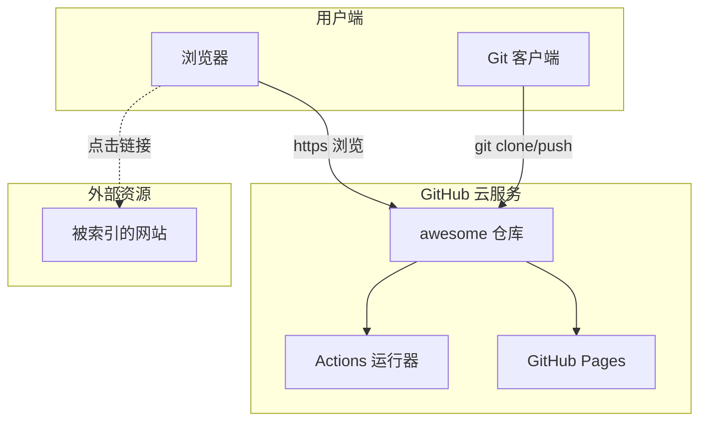
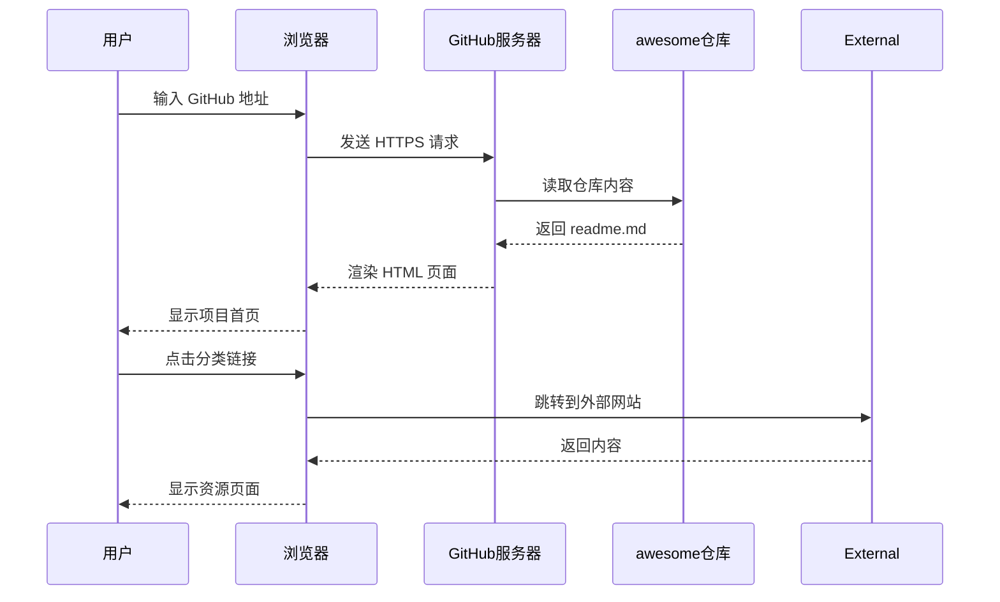

# awesome 项目 - 4+1 视图 UML 图

## 1. 逻辑视图 (Logical View) - 文件结构

## 2. 过程视图 (Process View) - PR 协作流程

## 3. 开发视图 (Development View) - 目录结构

## 4. 物理视图 (Physical View) - 部署架构

## 5. 场景示例 (Scenarios) - 用户查看项目

